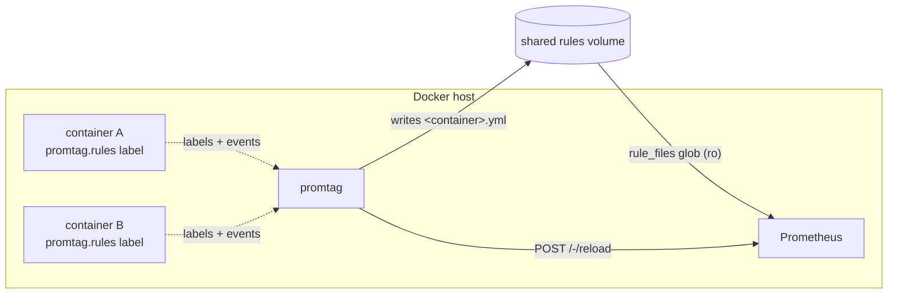

# promtag

**Prometheus alerting & recording rules, defined right on your Docker containers.**

[](https://github.com/davidborzek/promtag/actions/workflows/ci.yaml)
[](LICENSE)
[](https://github.com/davidborzek/promtag/releases)

promtag watches the Docker API and turns a container label into a Prometheus
rule file, then reloads Prometheus. Your rules live next to the service they
belong to — in the same compose file — instead of in a central, disconnected
config. Think of it as a tiny, self-hosted `PrometheusRule` operator for plain
Docker and Compose.

> [!WARNING]
> **Early-stage software.** promtag is pre-1.0 — expect rough edges and
> occasional breaking changes to labels or configuration before 1.0.

```yaml
services:
  myapp:
    image: myapp
    labels:
      promtag.rules: |
        - alert: MyAppDown
          expr: up{job="myapp"} == 0
          for: 2m
          labels: {severity: critical}
          annotations: {summary: "myapp is down"}
```

That's it. promtag renders this into a rule file, Prometheus loads it, done.

## How it works



1. promtag lists running containers and subscribes to Docker events.
2. For every container carrying a `promtag.rules` / `promtag.rules.<name>`
   label it validates each declared rule group and writes one file per group
   into the rules directory (a volume shared, read-only, with Prometheus).
3. When the on-disk state changes it calls Prometheus' reload endpoint.
4. When a container stops or loses its labels, its rule files are removed.

promtag **owns** the rules directory: any `*.yml` there that no longer maps to
a container is deleted. Point Prometheus at it with `rule_files: ["/rules/*.yml"]`.

## Quick start

A complete runnable stack (promtag + Prometheus + a socket proxy + an example
workload) lives in [`examples/`](examples/):

```sh
cd examples
docker compose up -d
# open http://localhost:9090/rules — the "node" group appears automatically
```

## Labels

| Label               | Description                                                              |
| ------------------- | ------------------------------------------------------------------------ |
| `promtag.rules`        | A rule group named after the container/service (the singleton form).     |
| `promtag.rules.<name>` | An additional rule group named `<name>`. Repeat for multiple groups.     |

A container is managed once it carries at least one of these labels; a single
container may declare several groups. Each value is a normal Prometheus rule
list — alert rules (`alert`/`expr`/`for`/`labels`/`annotations`) and recording
rules (`record`/`expr`/`labels`) are both supported.

## Configuration

All configuration is via environment variables:

| Variable                    | Default                              | Description                                              |
| --------------------------- | ------------------------------------ | -------------------------------------------------------- |
| `PROMTAG_RULES_DIR`       | `/rules`                             | Directory promtag owns and writes rule files into.     |
| `PROMTAG_RELOAD_URL`      | `http://localhost:9090/-/reload`     | Prometheus reload endpoint.                              |
| `PROMTAG_LABEL_PREFIX`    | `promtag`                          | Label namespace (`<prefix>.rules`, `<prefix>.rules.<name>`).    |
| `PROMTAG_RESYNC_INTERVAL` | `60s`                                | Periodic full reconcile, on top of event-driven ones.    |
| `PROMTAG_DEBOUNCE_DELAY`  | `1s`                                 | Coalesces bursts of container events into one reconcile. |
| `PROMTAG_LOG_LEVEL`       | `info`                               | `debug`, `info`, `warn`, `error`.                        |
| `PROMTAG_METRICS_ADDR`    | `:9333`                              | Listen address for the `/metrics` and `/healthz` endpoints. Blank disables them. |
| `DOCKER_HOST`               | (docker default)                     | Standard Docker client env; point it at a socket proxy.  |

`promtag --version` prints the build version and `promtag --help` shows the
usage; all runtime configuration is via the environment variables above.

## Prometheus requirements

- Start Prometheus with `--web.enable-lifecycle` so `POST /-/reload` works.
- Add the rules glob: `rule_files: ["/rules/*.yml"]`.
- Share the rules directory with promtag (promtag read-write, Prometheus
  read-only).

## Metrics

promtag exposes its own Prometheus metrics on `PROMTAG_METRICS_ADDR`
(default `:9333`) at `/metrics` — next to the standard Go runtime and process
metrics — plus a plain-text `/healthz` liveness probe on the same address:

| Metric | Type | Description |
| --- | --- | --- |
| `promtag_reconciles_total{result}` | counter | Reconcile runs by result. |
| `promtag_reconcile_duration_seconds` | histogram | Reconcile run duration. |
| `promtag_last_reconcile_timestamp_seconds` | gauge | Time of the last completed reconcile. |
| `promtag_last_reconcile_success_timestamp_seconds` | gauge | Time of the last successful reconcile. |
| `promtag_ready` | gauge | 1 if the last reconcile succeeded, else 0. |
| `promtag_managed_containers` | gauge | Containers currently declaring rules. |
| `promtag_managed_rule_files` | gauge | Rule files currently written. |
| `promtag_invalid_rules` | gauge | Rule groups that currently fail validation. |
| `promtag_reloads_total{result}` | counter | Prometheus reload attempts by result. |
| `promtag_watch_restarts_total` | counter | Docker event-stream resubscriptions. |
| `promtag_build_info{version}` | gauge | Build info, always 1. |

Since promtag manages Prometheus rules, you can monitor it with its own label
— for example alert when reconciles fail or rules go invalid:

```yaml
labels:
  promtag.rules: |
    - alert: PromtagReloadFailing
      expr: increase(promtag_reloads_total{result="error"}[15m]) > 0
      for: 15m
      labels: {severity: warning}
      annotations: {summary: "promtag cannot reload Prometheus"}
    - alert: PromtagInvalidRules
      expr: promtag_invalid_rules > 0
      for: 10m
      labels: {severity: warning}
```

A ready-made Grafana dashboard and Prometheus alert rules live in
[`dashboards/`](dashboards/).

## Sharing the rules directory across stacks

If promtag and Prometheus live in the **same** compose project (like
[`examples/`](examples/)), a plain named volume is enough.

If they live in **separate** compose projects, Compose namespaces named volumes
per project (`<project>_rules`), so they would not actually share storage. Use an
**external** volume instead — create it once and reference it from both files:

```sh
docker volume create promtag-rules
```

```yaml
# in both the promtag stack and the prometheus stack
volumes:
  rules:
    external: true
    name: promtag-rules
```

This is the same pattern as sharing a network across stacks: create the resource
up front, then reference it everywhere. Prometheus can still mount it read-only.

## Docker socket access

promtag needs read access to the Docker API (list containers, watch events).
Mounting the raw socket into a container grants full control of the host, so the
recommended setup is a **read-only socket proxy** that only exposes the
containers and events endpoints:

```yaml
services:
  docker-socket-proxy:
    image: ghcr.io/tecnativa/docker-socket-proxy:0.3.0
    environment:
      CONTAINERS: 1   # list containers + read labels
      EVENTS: 1       # stream lifecycle events
      PING: 1
    volumes:
      - /var/run/docker.sock:/var/run/docker.sock:ro

  promtag:
    image: ghcr.io/davidborzek/promtag:latest
    environment:
      DOCKER_HOST: tcp://docker-socket-proxy:2375
      PROMTAG_RELOAD_URL: http://prometheus:9090/-/reload
    volumes:
      - rules:/rules
    depends_on: [docker-socket-proxy]
```

promtag reads the standard `DOCKER_HOST` variable, so it talks to the proxy
over TCP and never touches the raw socket. If you do mount the socket directly
(`/var/run/docker.sock:/var/run/docker.sock:ro`), the container must be allowed
to read it (e.g. via `group_add`) — the proxy avoids that entirely and is the
preferred approach.

## Validation

promtag validates each rule's structure before writing it — exactly one of
`alert`/`record`, a non-empty `expr`, well-formed durations and label names.
Invalid rules are logged and skipped, so a broken label never reaches
Prometheus.

It deliberately does **not** embed the full PromQL parser (that would pull in the
entire Prometheus codebase). A syntactically invalid PromQL expression is caught
by Prometheus at reload time and surfaced in promtag's logs. This keeps the
binary tiny and the dependency tree small.

## License

[MIT](LICENSE)
